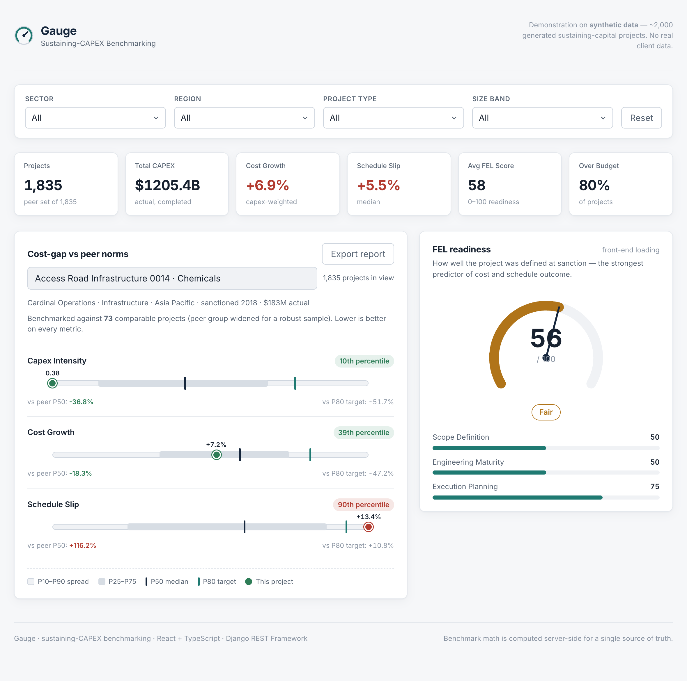
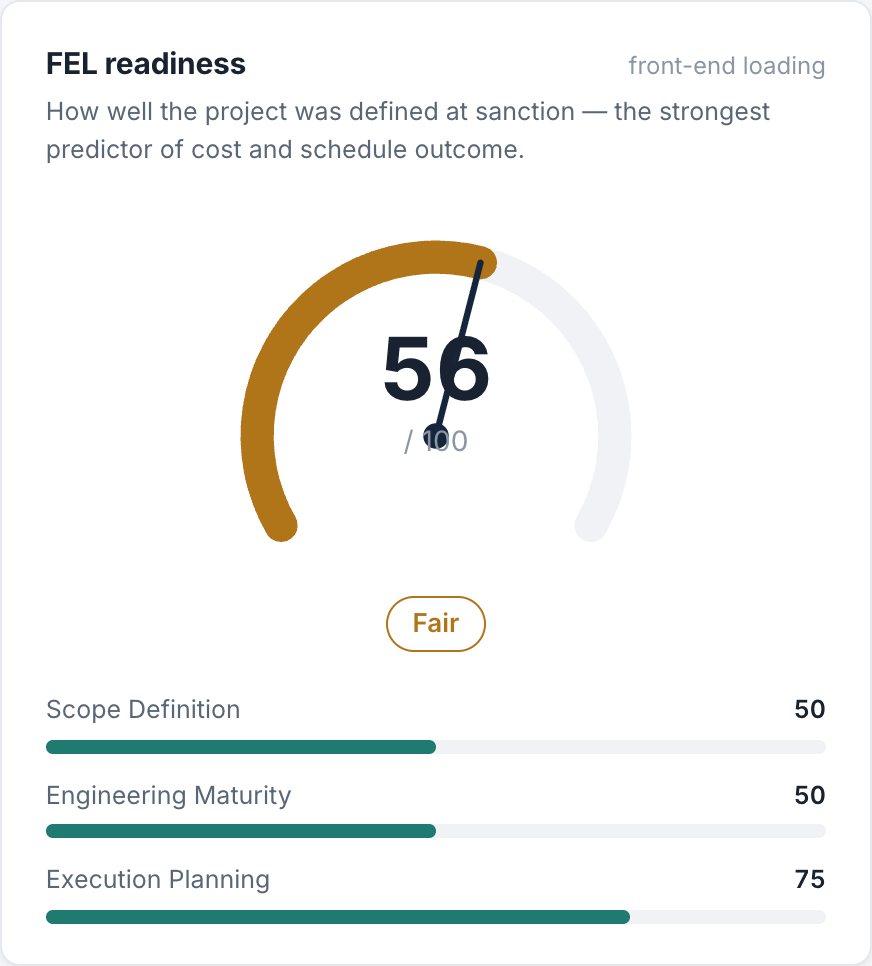

<p align="center">
  
</p>

<h1 align="center">Gauge — Sustaining-CAPEX Benchmarking Dashboard</h1>

<p align="center">
Enter a capital project and see where it sits against ~2,000 comparable ones:
cost-gap vs. P50/P80 norms, schedule predictability, an FEL-readiness score, and
a portfolio roll-up. <strong>React/TypeScript + Django/DRF, on synthetic data.</strong>
</p>

<p align="center">
  <em>React 19 · TypeScript · Vite · Django 4.2 · Django REST Framework · 37 tests</em>
</p>



<p align="center">
  
</p>

> 📖 **Full docs, architecture & API:** [`capbench-README.md`](capbench-README.md)
> · 🛠️ **Build write-up (the defensible decisions):** [`docs/BUILD_NOTES.md`](docs/BUILD_NOTES.md)

## What it does

- **Cost-gap benchmark** — a project's capex intensity, cost growth, and schedule
  slip against its peer group's P10–P90 spread, with **P50 median** / **P80
  target** markers, percentile rank, and gaps vs. each norm.
- **FEL-readiness score** — a 0–100 Front-End Loading index (the strongest
  predictor of cost/schedule outcome), shown as a radial gauge.
- **Portfolio roll-up** — KPI strip over any filtered slice (capex-weighted cost
  growth, median schedule slip, average FEL, % over budget).
- **Accessible & responsive** — aria-labelled SVG charts with a data-table
  fallback, keyboard focus, reduced-motion, mobile reflow, and a print→PDF report.

## Quick start

```bash
# Backend
cd backend && python3 -m venv .venv && source .venv/bin/activate
pip install -r requirements.txt
python manage.py migrate && python manage.py seed && python manage.py runserver

# Frontend (new terminal)
cd frontend && npm install && npm run dev   # http://localhost:5173
```

```bash
cd backend && pytest    # 37 tests on the stats, service, and API layers
```

> All data is synthetic — ~2,000 procedurally generated projects. **No real
> client data is used anywhere.**
